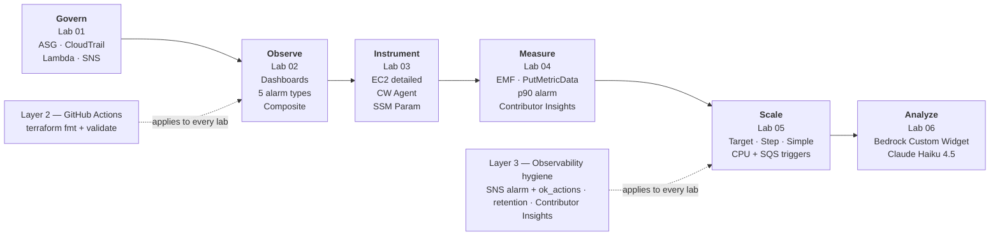

# AWS Observability Labs


Six Terraform-driven AWS CloudWatch labs covering governance, dashboards & alarms, CloudWatch Agent, EMF/PutMetricData custom metrics on a Flask Orders API, dynamic Auto Scaling (target / step / simple), and Bedrock Claude AI log analysis rendered inline on a dashboard.

---

## Purpose

A progressive series that tells one coherent monitoring story: how to go from a bare AWS account with no visibility to a production-grade observability posture with AI-assisted log analysis — every step in Terraform, every step deployable and destroyable in isolation.

The labs build on each other conceptually (not operationally — each lab is self-contained and owns its own VPC, dashboard, and alarms) so you can deploy a single lab to learn a specific technique, or walk the full arc:

> **Govern → Observe → Instrument → Measure → Scale → Analyze**

The finance-domain framing is deliberate: Labs 02 / 04 / 05 / 06 wire a trading-system workload (DynamoDB `trade-executions`, Flask Orders API, financial-orders SQS queue, trade-processor Lambda) into the CloudWatch story so the demos are closer to the problems a real data-engineering or cloud-architecture client would bring.

---

## Labs

| # | Lab | Description | Key Services |
|---|-----|-------------|--------------|
| 01 | [Governance Monitoring Overview](labs/01-governance-monitoring-overview/) | ASG + CPU alarms + SNS → Lambda (CloudTrail-enriched notifications) + CloudTrail trail | EC2, ASG, CloudWatch Alarms, SNS, Lambda, CloudTrail |
| 02 | [CloudWatch Metrics, Dashboards & Alarms](labs/02-cloudwatch-metrics-dashboards-alarms/) | Multi-service dashboard over EC2 / DynamoDB / S3 with five alarm types (threshold, stop-action, anomaly detection, DynamoDB spike, S3 delete audit) plus a composite alarm | CloudWatch, EC2, DynamoDB, S3, SNS |
| 03 | [EC2 Detailed Monitoring + CloudWatch Agent](labs/03-ec2-detailed-monitoring-cloudwatch-agent/) | 1-min built-in metrics side by side with CloudWatch Agent OS-level metrics; reactive CPU stop-action alarm and memory alarm | EC2, CloudWatch Agent, SSM Parameter Store, CloudWatch Logs, SNS |
| 04 | [Custom Metrics & Structured Logging (EMF + PutMetricData)](labs/04-custom-metrics-structured-logging/) | Flask Orders API publishing both EMF and SDK `PutMetricData` metrics; p90 latency alarm; Metrics Insights + Logs Insights + Contributor Insights dashboard | EC2, CloudWatch Agent, Metrics Insights, Logs Insights, Contributor Insights, SNS |
| 05 | [Dynamic Scaling with CloudWatch Alarms](labs/05-dynamic-scaling-cloudwatch-alarms/) | All three dynamic scaling policy types (Target Tracking, Step Scaling, Simple Scaling) driven from two trigger sources: EC2 CPU utilization and SQS queue depth | ASG, CloudWatch Alarms, SQS, EC2, SNS |
| 06 | [Bedrock CloudWatch Log Insights](labs/06-bedrock-cloudwatch-log-insights/) | CloudWatch **Custom Widget** backed by a Lambda that calls Amazon Bedrock (Claude Haiku 4.5) to render an HTML summary of the most recent log stream inline on the dashboard — AI root-cause analysis without leaving CloudWatch | Lambda, S3, Bedrock, CloudWatch Custom Widget, SNS |

Each lab includes a detailed README with mermaid diagram, draw.io architecture, deployment steps, validation commands, cost estimate, and the Layer-1/2/3 status for that lab.

---

## High-Level Architecture

The collection walks six stages of the monitoring lifecycle. Each stage maps to one lab; each lab owns its own AWS footprint.



Each lab has its own lower-level architecture diagram (`architecture.drawio` + `architecture.png` rendered in the AWS 2026 direct-shape style) and mermaid flowchart in its README.

---

## Prerequisites

- [Terraform](https://www.terraform.io/downloads) `>= 1.5`
- AWS provider `>= 5.0` (resolves to v6.x)
- [AWS CLI v2](https://docs.aws.amazon.com/cli/latest/userguide/install-cliv2.html) configured with appropriate credentials
- An AWS account with permissions for EC2, VPC, IAM, SSM, CloudWatch, SNS, Lambda, DynamoDB, S3, SQS, Bedrock, CloudTrail
- Default region: `us-east-1`
- Python 3.11+ for the load generators in Labs 04 and 05
- [draw.io](https://www.drawio.com/) (`brew install --cask drawio`) if you want to edit the architecture diagrams

---

## Quick Start

```bash
# Clone
git clone https://github.com/prasitstk/aws-observability-labs.git
cd aws-observability-labs

# Pick a lab
cd labs/04-custom-metrics-structured-logging/infrastructure/terraform

# Configure — edit any non-default values (region, project_name, notification_email)
cp terraform.tfvars.example terraform.tfvars

# Deploy
terraform init
terraform plan
terraform apply

# Validate (each lab's README has a dedicated Validation section)
# Tear down when done (CloudWatch dashboards, NAT-less VPCs, ASGs, Bedrock all bill while running)
terraform destroy
```

Every lab follows the same pattern. Labs are independent — you can deploy Lab 06 without deploying Lab 01 first.

---

## Local Validation

Run the same checks the CI workflow runs, before pushing:

```bash
# From the repo root
bash tests/validate.sh
```

The script discovers every Terraform directory under `shared/modules/` and `labs/`, then runs `terraform init -backend=false`, `fmt -check`, and `validate` on each. Expected output:

```
=== Terraform Validation Suite ===

Validating labs/01-governance-monitoring-overview/infrastructure/terraform... OK
Validating labs/02-cloudwatch-metrics-dashboards-alarms/infrastructure/terraform... OK
Validating labs/03-ec2-detailed-monitoring-cloudwatch-agent/infrastructure/terraform... OK
Validating labs/04-custom-metrics-structured-logging/infrastructure/terraform... OK
Validating labs/05-dynamic-scaling-cloudwatch-alarms/infrastructure/terraform... OK
Validating labs/06-bedrock-cloudwatch-log-insights/infrastructure/terraform... OK
Validating shared/modules/cw-instance-profile... OK
Validating shared/modules/cw-vpc... OK

All checks passed
```

> **Note:** First run downloads the AWS provider for each path and takes a minute or two.

---

## Shared Modules

Reusable Terraform modules consumed by the labs via relative paths (`source = "../../../../shared/modules/..."`):

| Module | Purpose |
|--------|---------|
| [`cw-vpc`](shared/modules/cw-vpc/) | Public-subnet VPC + internet gateway + base security group. Optional second public subnet for multi-AZ ASG labs (01 and 05). No NAT, no VPC endpoints — keeps baseline cost low. |
| [`cw-instance-profile`](shared/modules/cw-instance-profile/) | EC2 instance profile pre-wired with `CloudWatchAgentServerPolicy` + `AmazonSSMManagedInstanceCore`. Accepts `additional_policy_arns` so labs can layer in custom permissions (Lab 04 `PutMetricData`, Lab 05 SQS access). |

See each module's README for input/output documentation and usage examples.

---

## Comparative Analysis

See [`COMPARISON.md`](COMPARISON.md) for a structured, hands-on comparison of the monitoring techniques exercised across the labs — built-in vs detailed EC2 metrics, EMF vs `PutMetricData`, the alarm families (threshold / stop-action / anomaly detection / composite), the three dynamic scaling policy types, Logs Insights vs Metrics Insights vs Contributor Insights, and when CloudWatch-native tooling starts to reach its limits (the answer to which motivates Lab 06's Bedrock layer).

---

## Directory Structure

```
aws-observability-labs/
  README.md
  COMPARISON.md
  LICENSE
  .gitignore
  .devcontainer/devcontainer.json
  .github/
    dependabot.yml
    workflows/terraform-ci.yml     # Layer 2: CI/CD pipeline
  tests/validate.sh                # Local validation script
  docs/
  shared/
    modules/
      cw-vpc/                      # Public-subnet VPC (optional 2nd AZ)
      cw-instance-profile/         # CW Agent + SSM core instance profile
    policies/
      ec2-assume-role.json
  labs/
    01-governance-monitoring-overview/
    02-cloudwatch-metrics-dashboards-alarms/
    03-ec2-detailed-monitoring-cloudwatch-agent/
    04-custom-metrics-structured-logging/
    05-dynamic-scaling-cloudwatch-alarms/
    06-bedrock-cloudwatch-log-insights/
```

---

## Cost Awareness

These labs deliberately avoid NAT gateways and VPC endpoints (public-subnet architecture), which keeps the baseline cost modest — but CloudWatch dashboards, alarms, log ingestion, EC2, SQS, and Bedrock invocations all meter:

| Lab | Headline cost drivers | Typical monthly cost while running |
|-----|-----------------------|-------------------------------------|
| 01 | 1× EC2 in ASG, 2 SNS topics, Lambda, CloudTrail, dashboard | ~$5–15 |
| 02 | 2× EC2, DynamoDB on-demand, S3 request metrics, dashboard | ~$10–20 |
| 03 | 2× EC2 with detailed monitoring, CloudWatch Agent, log ingestion | ~$10–20 |
| 04 | 1× EC2 Flask API, 2 log groups, Contributor Insights rule, dashboard | ~$10–25 |
| 05 | 2× EC2 in ASG, SQS queue, 4 alarms, dashboard | ~$10–30 |
| 06 | 2 Lambdas (cold paths), S3, CloudWatch dashboard, pay-per-invocation Bedrock | ~$5 + $0.005–0.02 per widget refresh |

**Always run `terraform destroy` when done** — dashboards bill monthly even when idle, and Lab 05's ASG + SQS combination can accrue quickly under load testing.

---

## 5-Layer Enhancement Roadmap

This collection follows the five-layer elevation model used across the `prasitstk` labs portfolio:

| Layer | Status |
|-------|--------|
| 1. Infrastructure as Code (Terraform) | Done — all six labs |
| 2. CI/CD Pipeline (GitHub Actions) | Done — `terraform fmt -check` + `validate` on push and PR |
| 3. Monitoring & Observability (CloudWatch) | Done — dashboards + alarms + SNS with consistent `ok_actions`; Contributor Insights on Lab 04; Lambda alarms + SNS on Lab 06; standardized log retention |
| 4. Finance Domain Twist | In progress — Labs 02 / 04 / 05 / 06 already carry the trading-system framing; Labs 01 / 03 are planned |
| 5. Multi-Cloud Extension | Planned — Azure Monitor + Application Insights equivalents side by side |

### Why Layer 3 matters here

CloudWatch is the *subject* of these labs, so Layer 3 isn't an afterthought — it is the curriculum. Where a typical Layer 1 CloudWatch lab stops at "here is a dashboard", these labs layer in:

- **Consistent alarm → SNS wiring** with both `alarm_actions` and `ok_actions`, so operators see the recovery transition, not just the breach.
- **Contributor Insights** on high-volume JSON log groups (Lab 04) so a p90 alarm becomes a drill-down instead of a dead end.
- **Bedrock-driven root-cause summarization** (Lab 06) for the case where humans are reading logs at 3 a.m. and CloudWatch Logs Insights is not enough.
- **Standardized log retention** (14 days default, 30 days for application log groups and Bedrock Lambda logs) so cost does not silently drift.

---

## License

This project is licensed under the MIT License. See [LICENSE](LICENSE) for details.
