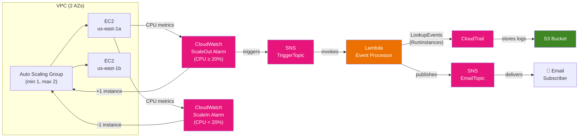
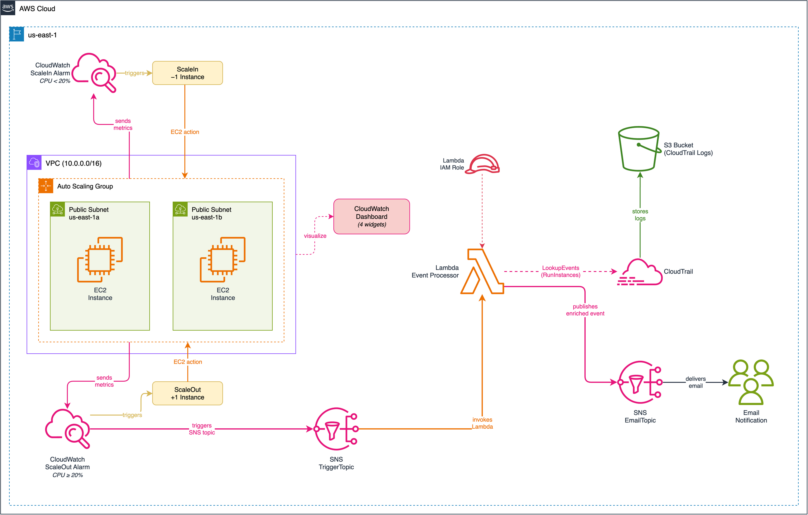

# Lab 01: Governance Monitoring Overview

Event-driven governance monitoring pipeline: Auto Scaling + CloudWatch alarms + Lambda + CloudTrail event enrichment + SNS email notifications.

## Objective

Build an automated monitoring system that integrates AWS management and governance services. CloudWatch alarms monitor EC2 CPU utilization in an Auto Scaling Group, trigger scaling actions, and invoke a Lambda function via SNS. The Lambda function queries CloudTrail for recent RunInstances events and sends enriched notifications to an email subscriber through a second SNS topic.

This lab demonstrates how multiple AWS services work together as an event-driven pipeline — the foundation for governance automation that later labs extend with deeper CloudWatch capabilities.

## Architecture





> Source: [architecture.drawio](architecture.drawio) — open with draw.io or VS Code extension

## Components

| Component | Resource | Purpose |
|---|---|---|
| VPC | `cw-vpc` module (2 AZ) | Public subnet networking for ASG |
| Instance Profile | `cw-instance-profile` module | EC2 IAM role (CloudWatch Agent + SSM) |
| Launch Template | `aws_launch_template` | EC2 config: AL2023, t2.micro, stress-ng |
| Auto Scaling Group | `aws_autoscaling_group` | Dynamic fleet: min 1, max 2, desired 1 |
| Scaling Policies | `aws_autoscaling_policy` (x2) | SimpleScaling: +1 (scale out) / -1 (scale in) |
| CloudWatch Alarms | `aws_cloudwatch_metric_alarm` (x2) | CPU ≥ 20% (scale out) / CPU < 20% (scale in) |
| SNS TriggerTopic | `aws_sns_topic` | Alarm → Lambda invocation channel |
| SNS EmailTopic | `aws_sns_topic` | Lambda → email notification channel |
| Lambda Function | `aws_lambda_function` | Queries CloudTrail, sends enriched notifications |
| CloudTrail | `aws_cloudtrail` | Management event logging to S3 |
| S3 Bucket | `aws_s3_bucket` | Versioned, encrypted CloudTrail log storage |
| Dashboard | `aws_cloudwatch_dashboard` | 4 widgets: ASG capacity, CPU, Lambda, alarm status |

## Key Concepts

- **Two-topic SNS pattern:** Decouples the raw alarm signal (TriggerTopic) from the user-facing notification (EmailTopic). The Lambda function enriches the raw alarm with CloudTrail context before delivering to email subscribers.
- **CloudTrail LookupEvents API:** Lambda queries CloudTrail's 90-day event history directly — no CloudWatch Logs integration needed. Filters by `EventName = RunInstances` to find scaling events.
- **SimpleScaling policies:** Basic +1/-1 instance adjustment with 60-second cooldown. Lab 05 covers advanced scaling patterns (TargetTracking, StepScaling).
- **Low alarm threshold (20%):** Deliberately low to make demo triggering easy with stress-ng. Production systems use higher thresholds.

## Deployment

```bash
cd labs/01-governance-monitoring-overview/infrastructure/terraform

# Copy and customize variables
cp terraform.tfvars.example terraform.tfvars
# Edit terraform.tfvars — set globally unique bucket name and email

terraform init
terraform plan
terraform apply
```

## Validation

```bash
# Verify ASG has launched an instance
aws autoscaling describe-auto-scaling-groups \
  --auto-scaling-group-names governance-monitoring-asg \
  --query 'AutoScalingGroups[0].Instances[*].{Id:InstanceId,State:LifecycleState}' \
  --region us-east-1

# Verify CloudTrail is active
aws cloudtrail get-trail-status \
  --name governance-monitoring-trail \
  --region us-east-1

# Verify Lambda function exists
aws lambda get-function \
  --function-name governance-monitoring-event-processor \
  --query 'Configuration.{Name:FunctionName,Runtime:Runtime,Timeout:Timeout}' \
  --region us-east-1

# Trigger stress test via SSM (use output from terraform output stress_test_command)
aws ssm send-command \
  --document-name AWS-RunShellScript \
  --targets Key=tag:Project,Values=governance-monitoring \
  --parameters 'commands=["stress-ng --cpu $(nproc) --timeout 300s"]' \
  --region us-east-1

# Check alarm state (wait ~2 minutes after stress starts)
aws cloudwatch describe-alarms \
  --alarm-names governance-monitoring-scale-out \
  --query 'MetricAlarms[0].StateValue' \
  --region us-east-1
```

After the alarm triggers, check your email for the enriched CloudTrail notification from Lambda.

## Cleanup

```bash
terraform destroy
```

## Cost Estimate

| Component | Estimated Monthly Cost |
|---|---|
| EC2 t2.micro (1-2 instances) | ~$7.50-15/month |
| CloudWatch Dashboard | $3/month |
| CloudWatch Alarms (2 alarms) | Free (first 10) |
| CloudTrail (first trail, management events) | Free |
| S3 storage (CloudTrail logs) | ~$0.01/month |
| Lambda | Free (under free tier) |
| SNS | Free (under free tier) |
| **Total** | **~$11-18/month** |

## Differentiation from Lab 05

Lab 01 and Lab 05 both use ASG + CloudWatch alarms, but with different focus areas:

| Aspect | Lab 01 (this lab) | Lab 05 |
|---|---|---|
| **Focus** | Event-driven notification pipeline | Scaling mechanics comparison |
| **Scaling type** | SimpleScaling (+1/-1) | TargetTracking + StepScaling |
| **Notification** | Lambda-enriched via CloudTrail | Direct SNS alarm notification |
| **Services** | ASG + CW + SNS + Lambda + CloudTrail | ASG + CW + SNS |
| **Key pattern** | Two-topic SNS + Lambda enrichment | Multi-policy scaling + lifecycle hooks |

## Enhancement Layers

- [x] **Layer 1: Infrastructure as Code** — Terraform baseline for VPC, ASG, launch template, CloudWatch alarms, SNS topics, Lambda, CloudTrail trail, dashboard.
- [x] **Layer 2: CI/CD Pipeline** — GitHub Actions `terraform-ci.yml` at the collection root runs `fmt -check` and `validate` on every push and PR.
- [x] **Layer 3: Monitoring & Observability** — Dashboard + CPU alarms + CloudTrail-enriched SNS notifications via the event-processor Lambda; `ok_actions` now fire on every alarm so operators see the recovery transition.
- [ ] **Layer 4: Finance Domain Twist** — SOX audit logging, trading system auto-scaling
- [ ] **Layer 5: Multi-Cloud Extension** — Azure Monitor + Activity Log side-by-side
