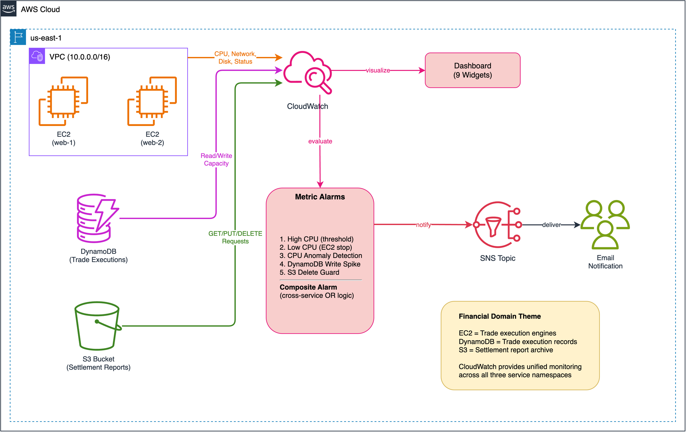
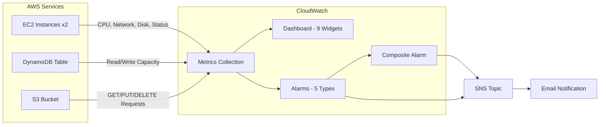

# Lab 02: CloudWatch Metrics, Dashboards & Alarms — Multi-Service Monitoring

Multi-service CloudWatch monitoring across EC2, DynamoDB, and S3. Built-in metrics, multi-widget dashboards, five alarm types (threshold, EC2 action, anomaly detection, DynamoDB write spike, S3 deletion guard), and composite alarm logic with a financial domain theme.

## Objective

Demonstrate CloudWatch's ability to unify monitoring across different AWS service types using a single dashboard and composite alarm. The lab deploys a financial trade processing scenario:

- **EC2 instances** — trade execution engines producing CPU, network, and disk metrics (basic 5-min resolution)
- **DynamoDB table** — trade execution records with on-demand capacity metrics
- **S3 bucket** — settlement reports with request-level metrics (GET/PUT/DELETE)

All three services feed into a shared CloudWatch dashboard, with service-specific alarms escalated through a cross-service composite alarm to SNS.

## Architecture



> Source: [architecture.drawio](architecture.drawio) — open with draw.io or VS Code extension



## Components

| Component | Resource | Purpose |
|---|---|---|
| VPC | `cw-vpc` module | Public subnet with internet gateway |
| Instance Profile | `cw-instance-profile` module | IAM role with CW Agent + SSM policies |
| EC2 Instances | `aws_instance` (x2) | Trade execution engines — generate built-in EC2 metrics |
| DynamoDB Table | `aws_dynamodb_table` | Trade execution records — on-demand (PAY_PER_REQUEST) |
| S3 Bucket | `aws_s3_bucket` + versioning + encryption | Settlement reports — versioned, encrypted, public access blocked |
| S3 Request Metrics | `aws_s3_bucket_metric` | Enables CloudWatch request-level metrics (GET/PUT/DELETE) |
| Dashboard | `aws_cloudwatch_dashboard` | 9 widgets: CPU, network, disk I/O, status checks, DynamoDB capacity, S3 requests, alarm status |
| High CPU Alarm | `aws_cloudwatch_metric_alarm` | Threshold: CPU > 80% for 2 periods |
| Low CPU Stop Alarm | `aws_cloudwatch_metric_alarm` | Auto-stop instances idle for 3 hours |
| Anomaly Alarm | `aws_cloudwatch_metric_alarm` | Anomaly detection band on CPU |
| DynamoDB Write Alarm | `aws_cloudwatch_metric_alarm` | Write capacity spike detection |
| S3 Delete Alarm | `aws_cloudwatch_metric_alarm` | Settlement report deletion guard |
| Composite Alarm | `aws_cloudwatch_composite_alarm` | Cross-service escalation: EC2 anomaly OR DynamoDB spike OR S3 deletion |
| SNS | `aws_sns_topic` | Alarm notification delivery |

## Key Concepts

- **Multi-service monitoring:** CloudWatch collects metrics from all AWS services into namespaces (`AWS/EC2`, `AWS/DynamoDB`, `AWS/S3`). A single dashboard can visualize metrics across namespaces, giving a unified view of distributed systems.
- **S3 request metrics activation delay:** `aws_s3_bucket_metric` enables request-level metrics, but they take **15-30 minutes** to appear in CloudWatch after creation. Built-in storage metrics (bucket size, object count) are available immediately but only update once per day.
- **DynamoDB on-demand metrics:** With `PAY_PER_REQUEST` billing, `ConsumedReadCapacityUnits` and `ConsumedWriteCapacityUnits` report actual consumption. Unlike provisioned mode, there are no `ProvisionedReadCapacityUnits` metrics — you monitor actual usage only.
- **Cross-service composite alarms:** The composite alarm combines EC2, DynamoDB, and S3 alarm states with OR logic, enabling a single escalation point for multi-service incidents.
- **Basic vs Detailed monitoring:** Basic sends EC2 metrics every 5 minutes (free). Detailed (`monitoring = true`) sends every 1 minute ($2.10/instance/month). This lab uses basic to demonstrate the default behavior.
- **Anomaly detection:** `ANOMALY_DETECTION_BAND(m1, 2)` creates a band 2 standard deviations from learned baseline. Requires ~2 weeks of data for accurate modeling.
- **EC2 action alarms:** `arn:aws:automate:<region>:ec2:stop` directly stops idle instances — no Lambda required.

## Deployment

```bash
cd labs/02-cloudwatch-metrics-dashboards-alarms/infrastructure/terraform

cp terraform.tfvars.example terraform.tfvars
# Edit terraform.tfvars — set a globally unique trade_reports_bucket_name

terraform init
terraform plan
terraform apply
```

## Validation

> **SSM Session Manager note:** The web console doesn't handle pasted multi-line
> commands with `\` continuation correctly — each line is sent individually.
> Keep commands on a single line or write them to a script file first.

```bash
# Verify instances are running
aws ec2 describe-instances \
  --filters "Name=tag:Project,Values=cw-metrics-alarms" \
  --query "Reservations[].Instances[].{Id:InstanceId,State:State.Name}" \
  --region us-east-1

# Check all alarms
aws cloudwatch describe-alarms \
  --alarm-name-prefix "cw-metrics-alarms" \
  --region us-east-1

# View dashboard in console
# CloudWatch > Dashboards > cw-metrics-alarms-dashboard

# --- EC2: Generate CPU load (SSH or SSM session into instance) ---
# sudo stress-ng --cpu 2 --timeout 600

# --- DynamoDB: Write trade records (trigger high-writes alarm) ---
# A single put-item won't exceed the threshold (default 5 WCUs in 5 min).
# Use a batch loop to generate enough writes:
for i in $(seq 1 10); do
  aws dynamodb put-item --table-name cw-metrics-alarms-trade-executions --item '{"trade_id":{"S":"TRD-'$i'"},"execution_timestamp":{"S":"2026-03-03T00:00:'$i'0Z"},"symbol":{"S":"AAPL"},"quantity":{"N":"100"},"price":{"N":"185.50"}}' --region us-east-1
done
# Alarm evaluates after one 5-minute period — check back in ~5 min

# Verify DynamoDB metric appears (may take a few minutes)
# Note: -v-1H is macOS date syntax. On Linux (e.g., SSM session),
#   use --date='1 hour ago' instead.
aws cloudwatch get-metric-statistics \
  --namespace AWS/DynamoDB \
  --metric-name ConsumedWriteCapacityUnits \
  --dimensions Name=TableName,Value=cw-metrics-alarms-trade-executions \
  --start-time "$(date -u -v-1H +%Y-%m-%dT%H:%M:%SZ)" \
  --end-time "$(date -u +%Y-%m-%dT%H:%M:%SZ)" \
  --period 300 --statistics Sum \
  --region us-east-1

# --- S3: Upload and delete a settlement report ---
echo "Settlement Report 2024-01-15" > /tmp/settlement.txt
aws s3 cp /tmp/settlement.txt s3://YOUR-BUCKET-NAME/reports/settlement-2024-01-15.txt
aws s3 rm s3://YOUR-BUCKET-NAME/reports/settlement-2024-01-15.txt

# Note: S3 request metrics take 15-30 min after bucket metric creation
# to appear in CloudWatch. The delete alarm uses a 24-hour period.

# Verify composite alarm includes all child alarms
aws cloudwatch describe-alarms \
  --alarm-names "cw-metrics-alarms-critical-composite" \
  --region us-east-1
```

## Cleanup

```bash
# Empty the S3 bucket first (required before terraform destroy)
aws s3 rm s3://YOUR-BUCKET-NAME --recursive

terraform destroy
```

## Cost Estimate

| Component | Estimated Monthly Cost |
|---|---|
| EC2 t2.micro (x2) | ~$15/month |
| DynamoDB (on-demand, minimal traffic) | <$0.01/month |
| S3 (versioned, minimal storage) | <$0.01/month |
| CloudWatch Dashboard | $3/month |
| CloudWatch Alarms (9 metric alarms) | Free (first 10) |
| SNS | Free tier |
| **Total** | **~$18/month** |

## Enhancement Layers

- [x] **Layer 1: Infrastructure as Code** — Terraform baseline for EC2, DynamoDB, S3, multi-widget dashboard, five alarm types, composite alarm, SNS.
- [x] **Layer 2: CI/CD Pipeline** — GitHub Actions `terraform-ci.yml` at the collection root runs `fmt -check` and `validate` on every push and PR.
- [x] **Layer 3: Monitoring & Observability** — Dashboard combining EC2 / DynamoDB / S3 widgets + five alarm types (threshold, low-CPU stop-action, anomaly detection, DynamoDB write spike, S3 delete audit) + composite alarm + consistent `ok_actions` wiring so every alarm notifies on recovery.
- [ ] **Layer 4: Finance Domain Twist** — Trading system SLA dashboards
- [ ] **Layer 5: Multi-Cloud Extension** — Azure Monitor metrics side-by-side
