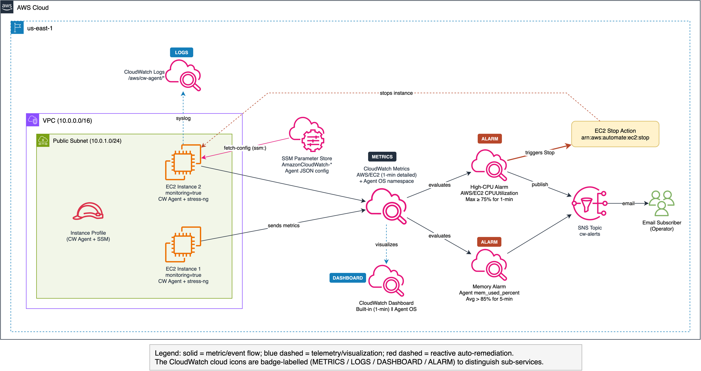
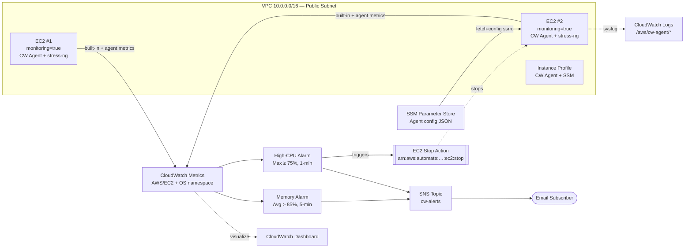

# Lab 03: EC2 Detailed Monitoring + CloudWatch Agent

EC2 detailed monitoring (1-minute built-in metrics) combined with CloudWatch Agent for OS-level metrics, plus a reactive CPU alarm that both emails an operator **and** stops the misbehaving instance automatically.

## Objective

Three layered concepts in one deployment:

1. **Detailed vs basic monitoring** — `monitoring = true` on `aws_instance` upgrades built-in metrics from 5-minute to 1-minute resolution.
2. **OS-level telemetry via CloudWatch Agent** — memory utilization, disk usage %, per-interface network — metrics the hypervisor cannot see.
3. **Reactive auto-remediation via EC2 action alarm** — a `CPUUtilization ≥ 75%` alarm publishes to SNS **and** issues the built-in `arn:aws:automate:<region>:ec2:stop` action, no Lambda needed. A side effect is that the instance is stopped as soon as a runaway workload is detected, bounding blast radius and cost.

A side-by-side dashboard pairs the built-in 1-minute EC2 metrics with the Agent's OS-level metrics, and an alarm widget surfaces the state of both the CPU and memory alarms.

## Architecture



> Source: [architecture.drawio](architecture.drawio) — open with draw.io or VS Code extension



## Components

| Component | Resource | Purpose |
|---|---|---|
| VPC | `cw-vpc` module | Public subnet with internet gateway |
| Instance Profile | `cw-instance-profile` module + extra policy | IAM role with CW Agent + SSM + log write |
| EC2 Instances | `aws_instance` (x2, `monitoring=true`) | Detailed monitoring + CW Agent + `stress-ng` installed via user_data |
| SSM Parameter | `aws_ssm_parameter` | CloudWatch Agent JSON configuration |
| Log Group | `aws_cloudwatch_log_group` | Syslog collection from agent |
| High-CPU Alarm | `aws_cloudwatch_metric_alarm` (x2) | Fires when `AWS/EC2 CPUUtilization` Max ≥ 75% (1-min). Actions: **stop instance** + publish to SNS |
| Memory Alarm | `aws_cloudwatch_metric_alarm` (x2) | Fires when agent's `mem_used_percent` > 85% |
| Dashboard | `aws_cloudwatch_dashboard` | Side-by-side: built-in 1-min vs Agent OS metrics + alarm status widget |
| SNS | `aws_sns_topic` | Alarm notification delivery to email |

## Key Concepts

- **Detailed monitoring:** `monitoring = true` on `aws_instance` enables 1-minute metric resolution. Cost: $2.10/instance/month for 7 pre-selected metrics.
- **CloudWatch Agent:** Installed via user_data, configured via SSM Parameter Store. Collects CPU breakdown (user/system/idle), memory, disk, disk I/O, and network — metrics that built-in EC2 monitoring does not provide.
- **Agent config via SSM:** The `AmazonCloudWatch-<name>` naming convention allows `amazon-cloudwatch-agent-ctl -c ssm:<param>` to fetch config at boot.
- **Custom namespace:** Agent metrics publish to `<project>/OS` to avoid collision with the reserved `AWS/EC2` namespace.
- **EC2 action alarms:** The built-in action ARN `arn:aws:automate:<region>:ec2:stop` lets a CloudWatch alarm stop the offending instance directly — no Lambda, no EventBridge target, no custom IAM. An alarm may carry multiple actions; here the alarm both stops the instance and publishes to SNS.
- **Statistic selection matters:** The CPU alarm uses `Maximum` (not `Average`) so a single hot minute is enough to trip the stop action. `Average` would smooth short spikes away.

### AWS documentation references

This lab was built from AWS public documentation (not reproduced from the Educative lab environment):

- [Create alarms to stop, terminate, reboot, or recover an EC2 instance](https://docs.aws.amazon.com/AmazonCloudWatch/latest/monitoring/UsingAlarmActions.html)
- [Enable detailed monitoring for your instances](https://docs.aws.amazon.com/AWSEC2/latest/UserGuide/using-cloudwatch-new.html)
- [Install the CloudWatch agent on an EC2 instance](https://docs.aws.amazon.com/AmazonCloudWatch/latest/monitoring/install-CloudWatch-Agent-on-EC2-Instance.html)
- [Store the CloudWatch agent configuration in Systems Manager Parameter Store](https://docs.aws.amazon.com/AmazonCloudWatch/latest/monitoring/download-cloudwatch-agent-commandline.html)
- [Collect metrics from EC2 instances with the CloudWatch agent](https://docs.aws.amazon.com/AmazonCloudWatch/latest/monitoring/create-cloudwatch-agent-configuration-file.html)
- [`aws_cloudwatch_metric_alarm` — Terraform AWS provider](https://registry.terraform.io/providers/hashicorp/aws/latest/docs/resources/cloudwatch_metric_alarm)

## CloudWatch Agent Metrics Collected

| Category | Metrics | Dimensions |
|---|---|---|
| CPU | `cpu_usage_idle`, `cpu_usage_user`, `cpu_usage_system` | InstanceId, cpu=cpu-total |
| Memory | `mem_used_percent`, `mem_available` | InstanceId |
| Disk | `disk_used_percent` | InstanceId, path=/, device, fstype |
| Disk I/O | `diskio_reads`, `diskio_writes` | InstanceId, name |
| Network | `net_bytes_sent`, `net_bytes_recv` | InstanceId, interface |

## Deployment

```bash
cd labs/03-ec2-detailed-monitoring-cloudwatch-agent/infrastructure/terraform

cp terraform.tfvars.example terraform.tfvars
# Edit terraform.tfvars if needed

terraform init
terraform plan
terraform apply
```

## Validation

```bash
# Verify detailed monitoring is enabled
aws ec2 describe-instances \
  --filters "Name=tag:Project,Values=ec2-detailed-cw-agent" \
  --query "Reservations[].Instances[].{Id:InstanceId,Monitoring:Monitoring.State}" \
  --region us-east-1

# Check CW Agent status (via SSM)
aws ssm send-command \
  --document-name "AWS-RunShellScript" \
  --targets "Key=tag:Project,Values=ec2-detailed-cw-agent" \
  --parameters 'commands=["/opt/aws/amazon-cloudwatch-agent/bin/amazon-cloudwatch-agent-ctl -a status"]' \
  --region us-east-1

# List custom metrics
aws cloudwatch list-metrics --namespace "ec2-detailed-cw-agent/OS" --region us-east-1

# --- Trigger the high-CPU stop alarm ---
# Open an SSM session to one instance and spike CPU. After ~1 minute the
# alarm transitions to ALARM, SNS fires an email, and the instance is stopped.
INSTANCE_ID=$(aws ec2 describe-instances \
  --filters "Name=tag:Project,Values=ec2-detailed-cw-agent" "Name=instance-state-name,Values=running" \
  --query "Reservations[0].Instances[0].InstanceId" --output text --region us-east-1)

aws ssm start-session --target "$INSTANCE_ID" --region us-east-1
# Inside the session — SSM drops you into /usr/bin as ssm-user (read-only),
# so stress-ng's default temp-path (CWD) fails with
# "aborting: temp-path '.' must be readable and writeable".
# Either cd to a writable dir first, or pass --temp-path:
#   cd /tmp && stress-ng --cpu $(nproc) --timeout 180s
#   # or
#   stress-ng --cpu $(nproc) --timeout 180s --temp-path /tmp

# Watch the alarm state flip
aws cloudwatch describe-alarms \
  --alarm-name-prefix "ec2-detailed-cw-agent-high-cpu-stop" \
  --query "MetricAlarms[].{Name:AlarmName,State:StateValue,Reason:StateReason}" \
  --region us-east-1
```

## Cleanup

```bash
# If the stop-alarm has already stopped an instance, terraform destroy still
# works — stopped instances can be terminated without first being started.
terraform destroy
```

## Cost Estimate

| Component | Estimated Monthly Cost |
|---|---|
| EC2 t2.micro (x2) | ~$15/month |
| Detailed monitoring (x2) | ~$4.20/month |
| CloudWatch Agent custom metrics (~10) | ~$3/month |
| CloudWatch Dashboard | $3/month |
| CloudWatch Logs | ~$1/month |
| **Total** | **~$26/month** |

## Enhancement Layers

- [x] **Layer 1: Infrastructure as Code** — Terraform baseline for EC2 detailed monitoring, CloudWatch Agent, SSM parameter, dashboard (1-min built-in vs Agent), stop-action alarm, memory alarm, SNS.
- [x] **Layer 2: CI/CD Pipeline** — GitHub Actions `terraform-ci.yml` at the collection root runs `fmt -check` and `validate` on every push and PR.
- [x] **Layer 3: Monitoring & Observability** — Side-by-side dashboard (built-in 1-min vs Agent OS-level), CPU stop-action alarm, memory alarm, SNS with `ok_actions` on both alarms so the recovery event is delivered to the same topic.
- [ ] **Layer 4: Finance Domain Twist** — Trading system memory/CPU profiling dashboards
- [ ] **Layer 5: Multi-Cloud Extension** — Azure Monitor Agent + Log Analytics side-by-side
