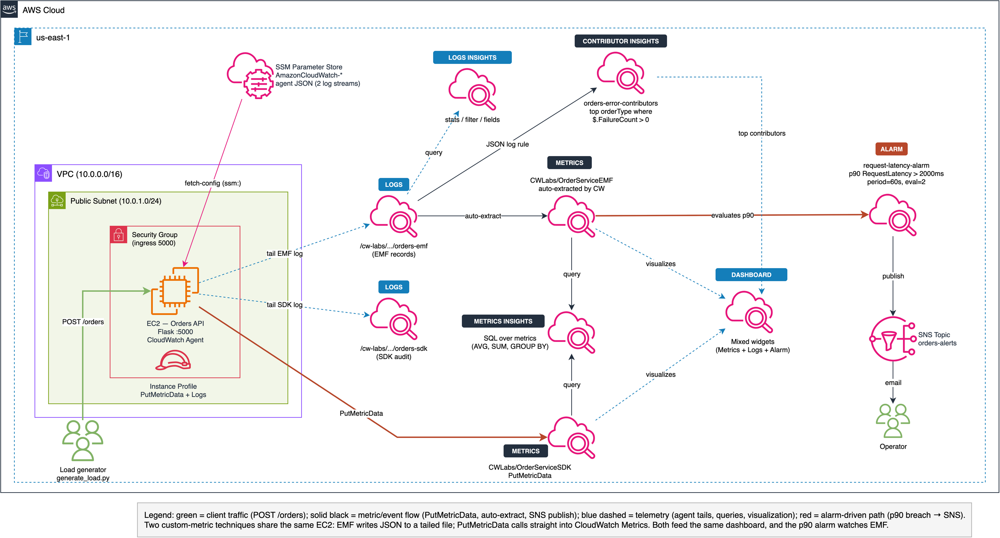
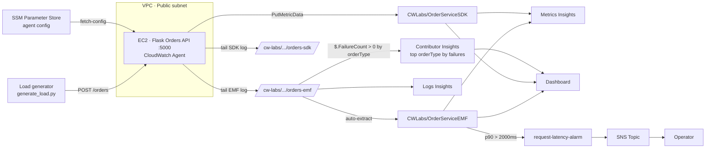

# Lab 04: Custom Metrics + Structured Logging (EMF + PutMetricData)

Two complementary custom-metric techniques side by side on a Flask Orders API: the Embedded Metric Format (EMF) and the `PutMetricData` SDK call. The lab produces two CloudWatch log groups, two custom metric namespaces, a p90 latency alarm, and a mixed dashboard that blends CloudWatch Metrics Insights, Logs Insights, and alarm status.

## Objective

Demonstrate how to publish custom CloudWatch metrics from application code without relying on log-pattern metric filters:

1. **Embedded Metric Format (EMF).** The Flask app writes a CloudWatch-native JSON record to a file tailed by the CloudWatch Agent. CloudWatch auto-extracts metrics from the `_aws` block — no metric filter, no `PutMetricData` call.
2. **`PutMetricData` SDK.** The same request path calls `cloudwatch.put_metric_data()` when the payload sets `useSDK=true`, and also writes a plain-JSON audit line to a second log group so Logs Insights can compare the two paths.

The lab also exercises CloudWatch Metrics Insights (SQL over metrics) and a `p90` latency alarm — features many "fundamentals" CloudWatch tutorials skip.

## Architecture



> Source: [architecture.drawio](architecture.drawio) — open with draw.io or the VS Code draw.io extension.



## Components

| Component | Resource | Purpose |
|---|---|---|
| VPC | `cw-vpc` module | Public subnet + IGW + shared instance SG |
| SG ingress rule | `aws_vpc_security_group_ingress_rule` | Opens port 5000 for the Flask API |
| IAM policy | `aws_iam_policy` | PutMetricData + Logs write + SSM `GetParameter` |
| Instance profile | `cw-instance-profile` module | CW Agent + SSM core + lab policy |
| SSM parameter | `aws_ssm_parameter` | `AmazonCloudWatch-*` holding the agent JSON (two log streams) |
| EC2 | `aws_instance` | Runs the Flask Orders API as a systemd service |
| Log group (EMF) | `aws_cloudwatch_log_group` | `/cw-labs/<project>/orders-emf` |
| Log group (SDK) | `aws_cloudwatch_log_group` | `/cw-labs/<project>/orders-sdk` |
| Alarm | `aws_cloudwatch_metric_alarm` | `request-latency-alarm` — p90 `RequestLatency` > 2000 ms |
| SNS | `aws_sns_topic` + subscription | Alarm delivery |
| Contributor Insights | `aws_cloudwatch_contributor_insight_rule` | Top `orderType` by failure count (JSON log rule over the EMF log group) |
| Dashboard | `aws_cloudwatch_dashboard` | Metrics Insights + Logs Insights + alarm status + Contributor Insights widget |

## Flask Orders API

`src/app.py` — a small Flask API listening on port 5000 with a single `POST /orders` route.

Request body fields (all optional):

| Field | Allowed values | Default |
|---|---|---|
| `orderType` | `Market`, `Limit`, `Stop` | `Market` |
| `region` | `us-east-1`, `eu-central-1`, `us-west-2` | `us-east-1` |
| `symbol` | Any ticker string | `AAPL` |
| `useSDK` | `true` / `false` | `false` |

Behaviour:
- Simulated latency: `Limit` orders take 0.6–2.6s (so they breach the p90 alarm); `Market` / `Stop` orders take 0.05–1.4s.
- ~25% of requests fail (HTTP 500); the rest return 200.
- On every request the app writes one EMF record to `/home/ec2-user/logs-emf-orders.log`. When `useSDK=true` it also calls `PutMetricData` into `CWLabs/OrderServiceSDK` and writes an audit record to `/home/ec2-user/logs-sdk-orders.log`.

### Custom metrics published

| Namespace | Metric | Unit | Dimensions | Produced by |
|---|---|---|---|---|
| `CWLabs/OrderServiceEMF` | `RequestLatency` | Milliseconds | `region`, `orderType` | EMF (agent → auto-extract) |
| `CWLabs/OrderServiceEMF` | `SuccessCount` | Count | `region`, `orderType` | EMF |
| `CWLabs/OrderServiceEMF` | `FailureCount` | Count | `region`, `orderType` | EMF |
| `CWLabs/OrderServiceSDK` | `RequestLatency` | Milliseconds | `region`, `orderType` | `PutMetricData` |
| `CWLabs/OrderServiceSDK` | `OrderOutcome` | Count | `region`, `orderType`, `status` | `PutMetricData` |

## AWS documentation references

The Terraform and app code are grounded in these references — useful when extending the lab:

- **Embedded Metric Format spec** — <https://docs.aws.amazon.com/AmazonCloudWatch/latest/monitoring/CloudWatch_Embedded_Metric_Format_Specification.html>
- **CloudWatch Agent configuration file reference** — <https://docs.aws.amazon.com/AmazonCloudWatch/latest/monitoring/CloudWatch-Agent-Configuration-File-Details.html>
- **`PutMetricData` API reference** — <https://docs.aws.amazon.com/AmazonCloudWatch/latest/APIReference/API_PutMetricData.html>
- **CloudWatch Metrics Insights query syntax** — <https://docs.aws.amazon.com/AmazonCloudWatch/latest/monitoring/cloudwatch-metrics-insights-querylanguage.html>
- **CloudWatch Logs Insights query syntax** — <https://docs.aws.amazon.com/AmazonCloudWatch/latest/logs/CWL_QuerySyntax.html>
- **Alarm extended statistics (percentiles)** — <https://docs.aws.amazon.com/AmazonCloudWatch/latest/monitoring/cloudwatch_concepts.html#Statistic>

## Deployment

```bash
cd labs/04-custom-metrics-structured-logging/infrastructure/terraform

cp terraform.tfvars.example terraform.tfvars
# Edit terraform.tfvars if you want to set notification_email or tighten
# orders_api_allowed_cidr to your own IP.

terraform init
terraform plan
terraform apply
```

Terraform outputs include `orders_api_url` (the full `POST /orders` URL) and both log group names.

## Generate load

Run the included client from your laptop after `terraform apply`:

```bash
# EMF-only (useSDK=false)
python src/generate_load.py --url "$(terraform -chdir=infrastructure/terraform output -raw orders_api_url)" --count 30

# EMF + PutMetricData SDK
python src/generate_load.py --url "$(terraform -chdir=infrastructure/terraform output -raw orders_api_url)" --count 30 --use-sdk
```

Each run produces ~30 datapoints across three simulated regions and three order types. Re-run multiple times to give Metrics Insights and the p90 alarm enough samples.

## Metrics Insights queries (run in the CloudWatch console)

Run these against the `CWLabs/OrderServiceEMF` namespace via *All metrics → Multi source query → Editor*:

```sql
-- Average request latency by region
SELECT AVG(RequestLatency)
FROM "CWLabs/OrderServiceEMF"
GROUP BY region
```

```sql
-- Region with the highest max latency
SELECT MAX(RequestLatency)
FROM "CWLabs/OrderServiceEMF"
GROUP BY region
ORDER BY MAX()
LIMIT 1
```

```sql
-- Success count by region + orderType
SELECT SUM(SuccessCount)
FROM "CWLabs/OrderServiceEMF"
GROUP BY region, orderType
```

```sql
-- Failure count by region + orderType
SELECT SUM(FailureCount)
FROM "CWLabs/OrderServiceEMF"
GROUP BY region, orderType
```

```sql
-- Compare: SDK OrderOutcome by status (uses CWLabs/OrderServiceSDK)
SELECT SUM(OrderOutcome)
FROM "CWLabs/OrderServiceSDK"
GROUP BY status
```

## Logs Insights queries

Run against `/cw-labs/<project>/orders-emf`:

```
fields @timestamp, region, orderType, symbol, RequestLatency, SuccessCount, FailureCount
| sort @timestamp desc
| limit 50
```

```
filter orderType = "Limit"
| stats avg(RequestLatency) by region
```

```
filter region = "us-east-1" and orderType = "Limit"
| stats pct(RequestLatency, 95)
```

```
filter FailureCount > 0
| stats count(*) as failures by region, orderType
```

```
filter FailureCount > 0
| stats count(*) as failures by region, orderType
| sort failures desc
| limit 10
```

```
fields @timestamp, SuccessCount, FailureCount
| stats sum(SuccessCount) as Successes, sum(FailureCount) as Failures by bin(5m)
| sort @timestamp desc
```

## Alarm: `request-latency-alarm`

- **Metric:** `CWLabs/OrderServiceEMF` / `RequestLatency`
- **Statistic:** `p90`
- **Threshold:** `> 2000` ms
- **Period:** 60 s · evaluations = 2
- **Actions:** SNS topic `orders-alerts` (both `ALARM` and `OK`)
- **Missing data:** `notBreaching`

Because `Limit` orders are seeded with 0.6–2.6 s latency, running the load generator with a mix of order types will push the p90 above the threshold within a few minutes and drop it back once traffic stops.

## Validation

```bash
# Service up? (submit the command — note the returned CommandId)
aws ssm send-command \
  --document-name "AWS-RunShellScript" \
  --targets "Key=tag:Project,Values=custom-metrics-logging" \
  --parameters 'commands=["systemctl status orders-api --no-pager"]' \
  --region us-east-1

# (Then, fetch the output using the CommandId from the previous step)
aws ssm list-command-invocations \
  --command-id <new-command-id> \
  --details \
  --region us-east-1

# EMF records showing up?
aws logs tail /cw-labs/custom-metrics-logging/orders-emf --since 5m --region us-east-1

# EMF-derived metrics appearing?
aws cloudwatch list-metrics --namespace "CWLabs/OrderServiceEMF" --region us-east-1

# PutMetricData path working?
aws cloudwatch list-metrics --namespace "CWLabs/OrderServiceSDK" --region us-east-1
```

## Cleanup

```bash
terraform destroy
```

## Cost estimate

| Component | Estimated monthly cost |
|---|---|
| EC2 `t2.micro` (x1) | ~$7.50 |
| CloudWatch custom metrics (5–7 unique, free tier covers first 10) | ~$0 |
| CloudWatch Logs (ingest + storage, 2 groups) | ~$3 |
| CloudWatch dashboard | $3 |
| CloudWatch alarm (1, free tier covers first 10) | ~$0 |
| SSM Parameter Store (Standard) | Free |
| SNS | Pennies |
| **Total** | **~$14/month** (while running) |

Always `terraform destroy` when you're done — CloudWatch dashboards and custom metrics continue to bill while the account holds them.

## Enhancement layers

- [x] **Layer 1: Infrastructure as Code** — Terraform baseline for VPC, EC2, IAM, SSM parameter, log groups, alarm, SNS, dashboard.
- [x] **Layer 2: CI/CD Pipeline** — GitHub Actions `terraform-ci.yml` at the collection root runs `fmt -check` and `validate` on every push and PR.
- [x] **Layer 3: Monitoring & Observability** — Contributor Insights rule on the EMF log group (top `orderType` by failures) wired into a dashboard widget; p90 latency alarm with SNS; 30-day log retention on both order log groups.
- [ ] **Layer 4: Finance Domain Twist** — Replace synthetic load with real market-data replay and publish latency per `venue` / `assetClass` dimension.
- [ ] **Layer 5: Multi-Cloud Extension** — Azure Application Insights custom telemetry side by side.
