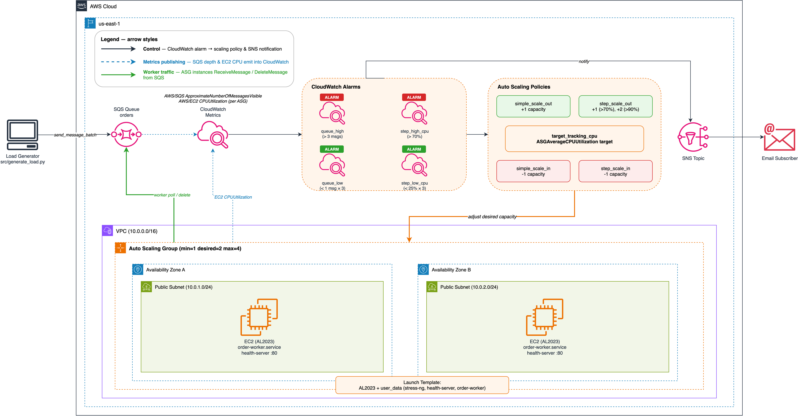
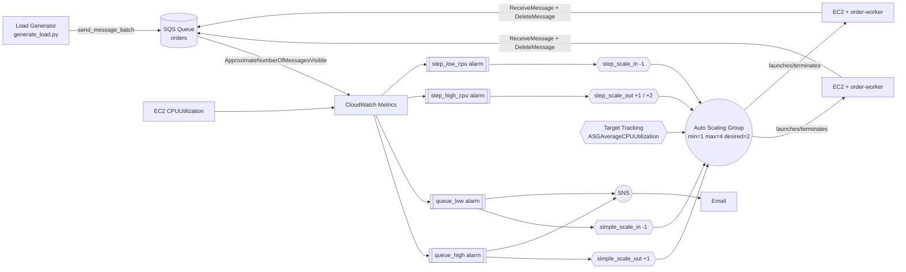

# Lab 05: Dynamic Scaling with CloudWatch Alarms

Auto Scaling Group covering **all three dynamic scaling policy types**
(`TargetTracking`, `StepScaling`, `SimpleScaling`) driven by **two distinct
trigger sources** — EC2 CPU utilization *and* SQS queue depth — with a
financial-orders worker that drains the queue in real time.

## Objective

Close the loop: CloudWatch alarms don't just notify — they drive infrastructure
changes. This lab shows two complementary scaling patterns on a single 2-AZ ASG:

- **CPU-based** — target tracking (hands-off, AWS-managed) and step scaling
  (fine-grained, alarm-driven) react to EC2 `CPUUtilization`.
- **Queue-depth-based** — simple scaling policies react to
  `AWS/SQS ApproximateNumberOfMessagesVisible` for a financial-orders queue,
  with an in-instance Python worker consuming messages so the queue actually
  drains.

Two demo paths (stress test and load generator) let you observe each scaling
signal independently on a single CloudWatch dashboard.

## Architecture



> Source: [architecture.drawio](architecture.drawio) — open with draw.io or the VS Code extension.



## Components

| Component | Resource | Purpose |
|---|---|---|
| VPC (2 AZ) | `cw-vpc` module | Multi-AZ public subnets for ASG |
| Instance Profile | `cw-instance-profile` module | IAM role: CW Agent + SSM core + `sqs_worker` policy |
| SQS Queue | `aws_sqs_queue.orders` | Financial orders queue (visibility 30s, retention 4d) |
| Launch Template | `aws_launch_template` | AL2023 + stress-ng + health server + order-worker systemd service |
| Auto Scaling Group | `aws_autoscaling_group` | Min 1, max 4, desired 2, 2 AZ, 7 enabled metrics |
| Target Tracking | `aws_autoscaling_policy` | Maintain ASG average CPU at target % |
| Step Scale Out | `aws_autoscaling_policy` | +1 at 70% CPU, +2 at 90% CPU |
| Step Scale In | `aws_autoscaling_policy` | -1 when CPU < 25% |
| Simple Scale Out | `aws_autoscaling_policy` | +1 when queue depth > 3 |
| Simple Scale In | `aws_autoscaling_policy` | -1 when queue depth < 1 |
| CPU Alarms | `aws_cloudwatch_metric_alarm` (×2) | `step_high_cpu`, `step_low_cpu` |
| Queue Alarms | `aws_cloudwatch_metric_alarm` (×2) | `queue_high`, `queue_low` |
| Dashboard | `aws_cloudwatch_dashboard` | ASG capacity, CPU (w/ thresholds), network, queue depth, SQS rates, all four alarms |
| SNS | `aws_sns_topic` | Scaling event and queue alarm notifications |
| Order Worker | systemd `order-worker.service` | Python 3 process on each instance: long-poll SQS → process → delete |
| Load Generator | `src/generate_load.py` | Sends order payloads to seed the queue for demos |

## Key Concepts

- **Three policy types, one ASG.** Target tracking, step scaling, and simple
  scaling can all attach to the same ASG. Target tracking manages its own
  alarms and cooldown; step and simple scaling need explicit alarms.
- **Two trigger sources.** EC2 metrics (CPU) reflect load on the instances;
  SQS metrics reflect upstream backlog. A backlog-based trigger scales before
  CPU spikes, which is critical for worker-queue workloads.
- **`treat_missing_data`.** Use `"missing"` on CPU alarms (so they don't flip
  during ASG scale-in when instances disappear) and `"notBreaching"` on the
  queue alarms (an empty queue is the healthy steady state).
- **Cooldown periods.** Simple scaling uses `cooldown = 60s` (scale-out) and
  `120s` (scale-in) to avoid thrashing when the load generator batch lands.

## Scaling Policy Comparison

| Aspect | Target Tracking | Step Scaling | Simple Scaling |
|---|---|---|---|
| Configuration | Single target value | Step adjustments per alarm | Single adjustment per alarm |
| Alarm management | AWS creates / manages | You create and maintain | You create and maintain |
| Granularity | One adjustment per direction | Different adjustments per threshold | One per direction |
| Cooldown | Built-in, self-managed | Uses ASG default cooldown | Per-policy `cooldown` attribute |
| Best for | Steady-state workloads | Bursty or predictable traffic | Queue-depth / simple on/off |

## Deployment

```bash
cd labs/05-dynamic-scaling-cloudwatch-alarms/infrastructure/terraform

cp terraform.tfvars.example terraform.tfvars
# Edit terraform.tfvars if needed (e.g., notification_email)

terraform init
terraform plan
terraform apply
```

## Trigger SQS-based scaling (simple scaling policies)

Seed the orders queue with 20 messages; `queue_high` trips within ~90s and the
ASG scales out. The in-instance worker drains the queue; `queue_low` then trips
and the ASG scales back in.

```bash
# From the lab directory
python src/generate_load.py \
  --queue-url "$(terraform -chdir=infrastructure/terraform output -raw queue_url)" \
  --region us-east-1 \
  --count 20

# Watch ASG capacity change
watch -n 30 "aws autoscaling describe-auto-scaling-groups \
  --auto-scaling-group-names dynamic-scaling-asg \
  --query 'AutoScalingGroups[0].{Desired:DesiredCapacity,Min:MinSize,Max:MaxSize,InService:length(Instances)}' \
  --region us-east-1"
```

## Trigger CPU-based scaling (step + target tracking)

```bash
aws ssm send-command \
  --document-name "AWS-RunShellScript" \
  --targets "Key=tag:Project,Values=dynamic-scaling" \
  --parameters 'commands=["stress-ng --cpu $(nproc) --timeout 300s"]' \
  --region us-east-1
```

## Cleanup

```bash
terraform destroy
```

## Cost Estimate

| Component | Estimated Monthly Cost |
|---|---|
| EC2 t2.micro (1–4 instances) | ~$7.50–30/month |
| CloudWatch Dashboard | $3/month |
| CloudWatch Alarms (4 custom + target tracking auto) | Free tier (first 10) |
| SQS Standard (demo volume) | Free tier (first 1M requests) |
| SNS | Free tier |
| **Total** | **~$10–33/month** |

## References

Built from AWS public documentation:

- *AWS Auto Scaling User Guide* — "Simple scaling policies" and "Scaling based
  on Amazon SQS"
- *Amazon CloudWatch User Guide* — "Using Amazon CloudWatch alarms"
- *Amazon SQS Developer Guide* — "Amazon SQS metrics"

## Enhancement Layers

- [x] **Layer 1: Infrastructure as Code** — Terraform baseline for VPC, ASG, launch template, SQS queue, target-tracking + step + simple scaling policies, four CloudWatch alarms, SNS, dashboard.
- [x] **Layer 2: CI/CD Pipeline** — GitHub Actions `terraform-ci.yml` at the collection root runs `fmt -check` and `validate` on every push and PR.
- [x] **Layer 3: Monitoring & Observability** — Dashboard with queue-depth annotations + SQS throughput widgets + four alarms (step_high_cpu, step_low_cpu, queue_high, queue_low) now publishing both to the scaling policy **and** to SNS (with `ok_actions`) so every scaling event produces an operator-visible notification.
- [ ] **Layer 4: Finance Domain Twist** — Scale on custom metric *TradeVolume* (trades-per-second) with dynamic pricing model
- [ ] **Layer 5: Multi-Cloud Extension** — Azure VMSS + Autoscale side-by-side
