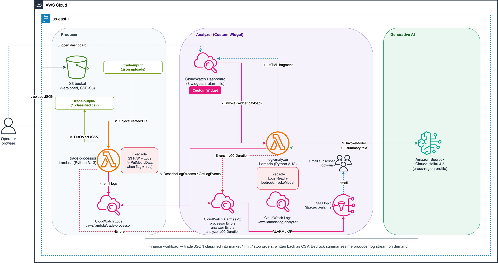
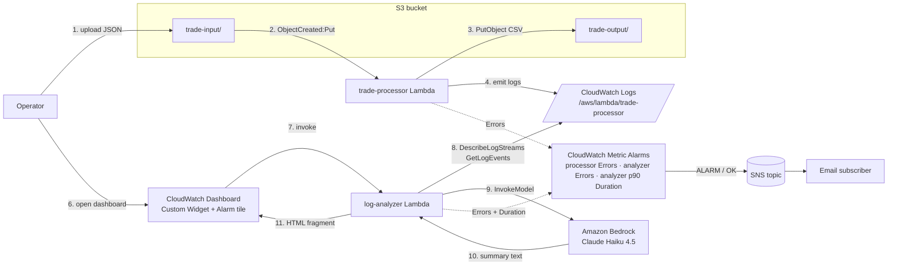

# Lab 06: Bedrock CloudWatch Log Insights

AI-powered root-cause analysis delivered **inline on a CloudWatch dashboard**. A CloudWatch Custom Widget invokes a Lambda that pulls the most recent log stream of a target log group, sends the events to Amazon Bedrock (Claude Haiku 4.5 via a cross-region inference profile), and renders an HTML summary inside the dashboard tile — no SNS round-trip, no email, no EventBridge rule required.

This is the monitoring-story capstone for `aws-cw-labs`: governance → fundamentals → Agent → custom metrics → scaling → **AI log summarisation**.

## Objective

Demonstrate the least-known integration point between CloudWatch and Lambda — the **Custom Widget** — as a packaging mechanism for on-demand generative-AI log analysis. The lab is intentionally self-contained:

1. A **trade-processor** Lambda simulates a realistic finance workload. It reads a JSON batch of trade records from S3, classifies each trade (market / limit / stop), writes a CSV back to the same bucket, and publishes a small CloudWatch custom metric.
2. The Terraform `grant_processor_putmetric` flag defaults to `false`, which means the processor's role **cannot** publish metrics on first deploy. The resulting `AccessDeniedException` in the logs is the signal Bedrock summarises — operators see a diagnosis and remediation steps directly in the dashboard.
3. A **log-analyzer** Lambda, invoked by the dashboard's Custom Widget, fetches the last 50 events from the processor log stream and sends them to Bedrock with a structured prompt (Overview / Errors / Root Cause / Next Steps).

Flip `grant_processor_putmetric = true`, re-apply, re-upload the sample, refresh the widget — the summary is now a clean "operational success" report.

## Architecture



> Source: [architecture.drawio](architecture.drawio) — open with draw.io or the VS Code draw.io extension.



## Components

| Component | Resource | Purpose |
|---|---|---|
| S3 bucket | `aws_s3_bucket` + versioning + SSE-S3 + public-access-block + lifecycle | Accepts trade JSON batches under `trade-input/`, stores classified CSVs under `trade-output/` |
| S3 → Lambda notification | `aws_s3_bucket_notification` + `aws_lambda_permission` | Triggers the processor on `s3:ObjectCreated:Put` filtered by prefix + `.json` suffix |
| Trade processor | `aws_lambda_function` (Python 3.13) | Classifies trades, writes CSV, publishes `TradesClassified` custom metric |
| Processor IAM | `aws_iam_role` + inline `aws_iam_role_policy` | `s3:GetObject`/`PutObject` on the lab bucket, scoped Logs write; `cloudwatch:PutMetricData` is gated on `grant_processor_putmetric` |
| Log analyzer | `aws_lambda_function` (Python 3.13) | Widget backend — reads processor's log stream, calls Bedrock, returns HTML |
| Analyzer IAM | `aws_iam_role` + inline `aws_iam_role_policy` | `logs:DescribeLogStreams`/`GetLogEvents`/`FilterLogEvents`/`StartQuery`/`GetQueryResults` scoped to the processor log group; `bedrock:InvokeModel` scoped to the inference profile + foundation model |
| Widget invocation permission | `aws_lambda_permission` | Allows `cloudwatch.amazonaws.com` (dashboard source ARN) to invoke the analyzer |
| Log groups | 2× `aws_cloudwatch_log_group` | `/aws/lambda/<project>-trade-processor`, `/aws/lambda/<project>-log-analyzer` with 30-day default retention |
| Alarms | 3× `aws_cloudwatch_metric_alarm` | `trade-processor-errors` (Errors ≥ 1, 60s), `log-analyzer-errors` (Errors ≥ 1, 60s), `log-analyzer-duration-p90` (p90 ≥ 25s over 2× 5-min windows) |
| SNS topic | `aws_sns_topic` + optional email subscription | Alarms publish `ALARM` and `OK` transitions; subscription gated on `notification_email` |
| Dashboard | `aws_cloudwatch_dashboard` | Text instructions + Custom Widget (Bedrock summary) + 4 analyzer observability tiles + 1 processor metric + 1 Logs Insights tile + 1 alarm-status tile |

## AWS documentation references

Every design decision is grounded in a public AWS doc — no Educative copy here:

- **Bedrock Runtime `InvokeModel`** — <https://docs.aws.amazon.com/bedrock/latest/APIReference/API_runtime_InvokeModel.html>
- **Anthropic Claude Messages API on Bedrock** — <https://docs.aws.amazon.com/bedrock/latest/userguide/model-parameters-anthropic-claude-messages.html>
- **Cross-region inference profiles** — <https://docs.aws.amazon.com/bedrock/latest/userguide/cross-region-inference.html>
- **CloudWatch Custom Widgets** — <https://docs.aws.amazon.com/AmazonCloudWatch/latest/monitoring/CloudWatch-custom-widgets.html>
- **CloudWatch Logs `DescribeLogStreams`** — <https://docs.aws.amazon.com/AmazonCloudWatchLogs/latest/APIReference/API_DescribeLogStreams.html>
- **CloudWatch Logs `GetLogEvents`** — <https://docs.aws.amazon.com/AmazonCloudWatchLogs/latest/APIReference/API_GetLogEvents.html>
- **S3 Event Notifications (Lambda destination)** — <https://docs.aws.amazon.com/AmazonS3/latest/userguide/notification-how-to-event-types-and-destinations.html>

## Deployment

```bash
cd labs/06-bedrock-cloudwatch-log-insights/infrastructure/terraform

cp terraform.tfvars.example terraform.tfvars
# Edit terraform.tfvars if you want to pin a bucket_name_override, change
# the Bedrock model, or receive alarm emails (set notification_email).

terraform init
terraform plan
terraform apply
```

Terraform outputs include the bucket name, the processor log-group ARN, the analyzer ARN, the dashboard URL, and a ready-to-use `upload_sample_command`.

## Trigger the pipeline

```bash
# Seed the bundled sample batch
aws s3 cp ../../src/sample-trades.json \
  s3://$(terraform output -raw s3_bucket_name)/trade-input/sample-trades.json \
  --region us-east-1

# Tail the processor logs
aws logs tail $(terraform output -raw trade_processor_log_group) --since 5m --region us-east-1
```

Then open the **dashboard URL** from `terraform output dashboard_url`. The first time CloudWatch renders the Custom Widget it will ask you to **allow** the dashboard to invoke the analyzer Lambda — choose *Allow always*. The widget body will render the Bedrock-generated summary.

### The "controlled failure" demo

With the default `grant_processor_putmetric = false`, the processor emits:

```
cloudwatch:PutMetricData failed with AccessDeniedException — missing IAM permission on trade-processor role.
Re-apply Terraform with grant_processor_putmetric=true to fix.
```

Refresh the Custom Widget. Bedrock should call out the missing permission in its **LIKELY ROOT CAUSE** and **RECOMMENDED NEXT STEPS** sections.

To "fix" the role:

```bash
terraform apply -var="grant_processor_putmetric=true"
```

Re-upload the sample and refresh — the widget now reports a clean operational summary with no errors.

## Validation

```bash
# Both Lambdas created?
aws lambda list-functions --region us-east-1 \
  --query 'Functions[?starts_with(FunctionName, `bedrock-log-insights`)].FunctionName'

# S3 notification configured?
aws s3api get-bucket-notification-configuration \
  --bucket $(terraform output -raw s3_bucket_name) --region us-east-1

# Dashboard exists?
aws cloudwatch get-dashboard \
  --dashboard-name $(terraform output -raw dashboard_name) --region us-east-1 \
  --query 'DashboardName'

# Invoke the analyzer manually (mirrors the widget payload)
aws lambda invoke --function-name $(terraform output -raw log_analyzer_function_name) \
  --payload "$(printf '%s' "{\"widgetContext\":{\"params\":{\"log_group_arn\":\"$(terraform output -raw trade_processor_log_group_arn)\"}}}" | base64)" \
  --region us-east-1 /tmp/widget.out
cat /tmp/widget.out
```

## Cleanup

```bash
terraform destroy
```

The bucket uses `force_destroy = true`, so Terraform will empty it before deleting.

## Cost estimate

| Component | Estimated monthly cost |
|---|---|
| Lambda invocations (demo volume) | ~$0.01 |
| S3 storage (kilobytes of JSON + CSV) | ~$0 |
| CloudWatch Logs (2 groups, short retention) | ~$1 |
| CloudWatch Dashboard | $3 |
| Bedrock Claude Haiku 4.5 per invocation | ~$0.005–0.02 (input + output tokens) |
| **Total while running** | **~$5/month + per-click Bedrock cost** |

Always `terraform destroy` when done — CloudWatch dashboards bill monthly even when idle.

## Enhancement layers

- [x] **Layer 1: Infrastructure as Code** — Terraform for both Lambdas, S3 bucket, IAM, custom-widget dashboard, and grounded Bedrock invocation.
- [x] **Layer 2: CI/CD Pipeline** — GitHub Actions `terraform-ci.yml` at the collection root runs `fmt -check` and `validate` on every push and PR.
- [x] **Layer 3: Monitoring & Observability** — Three Lambda alarms (processor Errors, analyzer Errors, analyzer p90 Duration) + SNS topic with optional email subscription + alarm-status dashboard tile + 30-day log retention.
- [ ] **Layer 4: Finance Domain Twist** — Replace the synthetic classifier with a MiFID II pre-trade compliance check; have Bedrock summarise rejected trades with citations to the rule that fired.
- [ ] **Layer 5: Multi-Cloud Extension** — Azure Monitor Workbook + Azure OpenAI side-by-side, same controlled-failure storyline.
